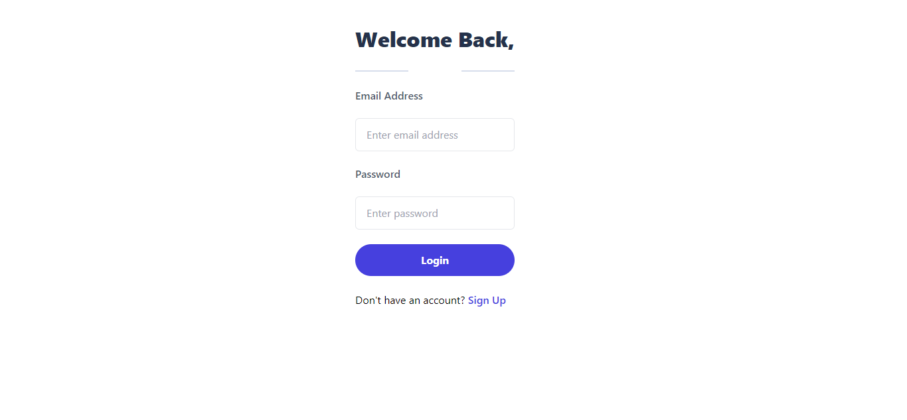
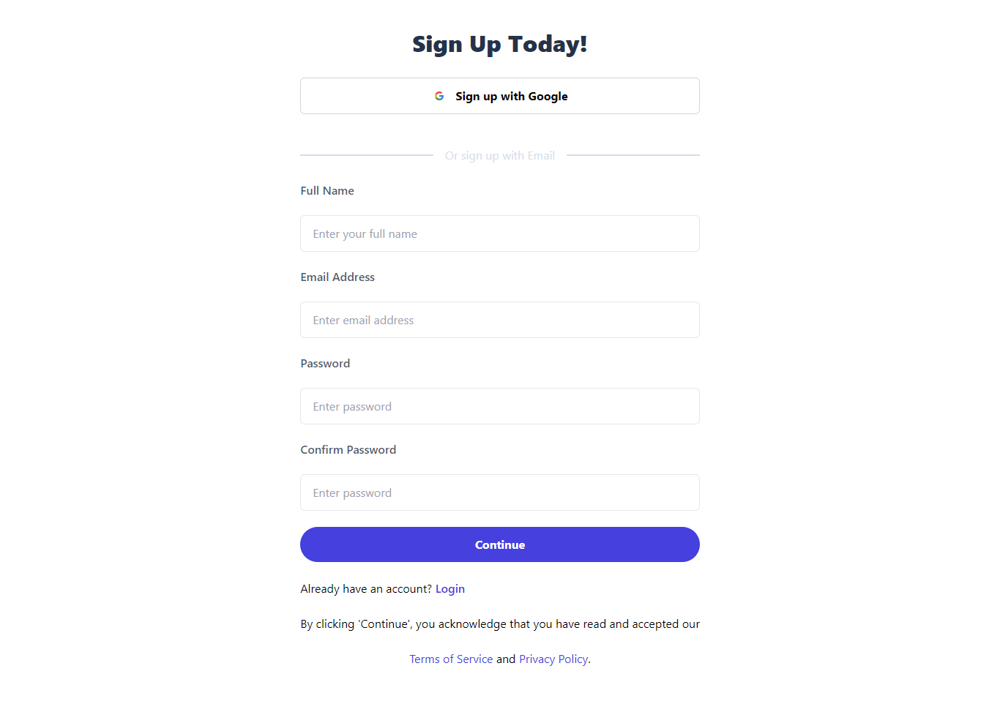
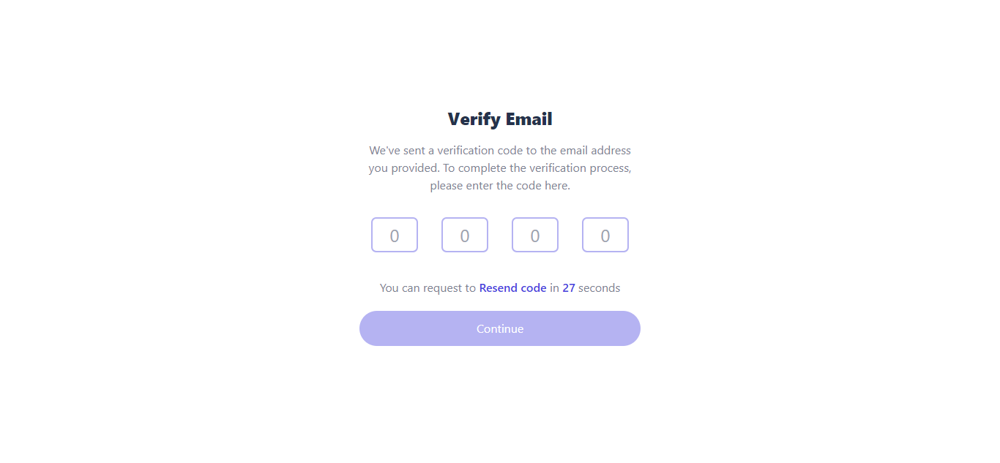
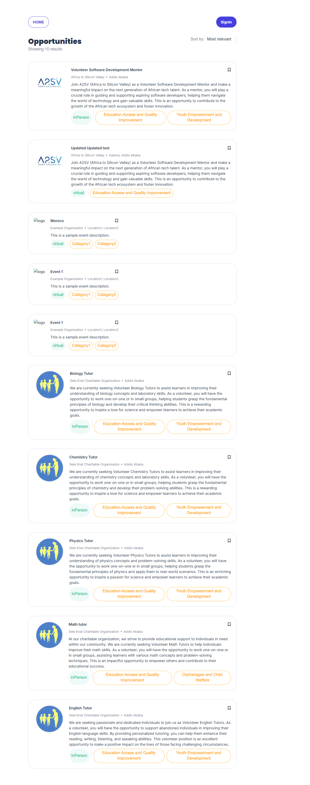
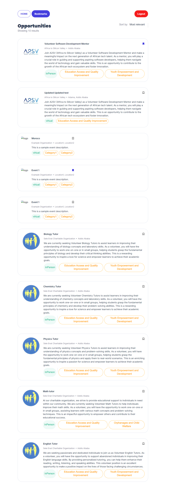
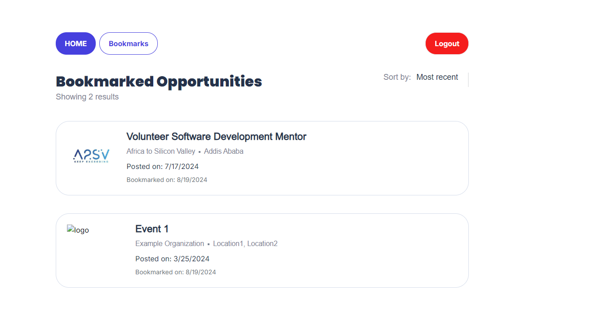

# job-listing

A job listing UI with description page included

## To run the page follow the following instructions

- Clone this repo

```bash
git clone https://github.com/biniyamNegasa/job-listing.git
```

- Get into the folder

```bash
cd job-listing
```

- Change branch

```bash
git checkout bookmark-branch
```

- run the following

```bash
npm install && npm run dev
```

## Here are sample screenshots for the pages

### Sign in page



### Sign up page



### OTP form page



### Landing page with out logging in

It has the list jobs of available


### Description page

Each job has its own detailed page


### Landing page with logging in



### Bookmark page


